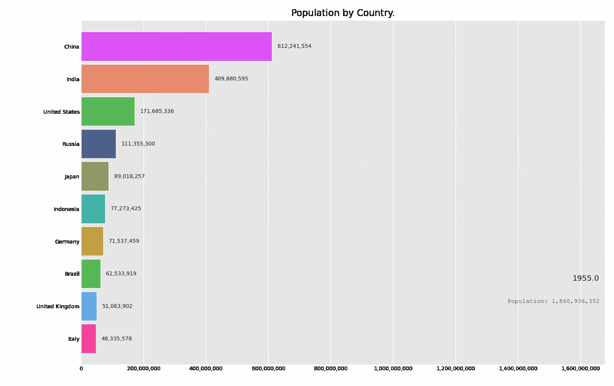

# 100DaysofDataScience
A 100 Day Data Science Challenge to learn and implement DS concepts ranging from the beginner of Data Science to Data Scientist.

According to [Harvard](https://hbr.org/2012/10/data-scientist-the-sexiest-job-of-the-21st-century), Data Scientist is the **Sexiest** job of the 21st century.
<center>


<font size=2>
Image Credit: By Calvin.Andrus (Own work) [CC BY-SA 3.0 (http://creativecommons.org/licenses/by-sa/3.0)], via Wikimedia Commons.
</font>
</center>

# ``` THIS REPO IS IN PROGRESS ... ``` 🚀 👨‍💻

## Day 0 | 11 August 2020

D-Day is here and finally, I am accepting 100 days of data sciecne code challenge.

Today I am starting a challenge, which is “100-Days-Of-Data-Science-Code” and the intuition behind this to dedicate at least one hour of every day for next 100 days in studying and/or coding Data Science concepts. I will share my progress via :

GitHub: https://github.com/themlphdstudent/100DaysofDataScience

Twitter : https://www.twitter.com/@themlphdstudent

Instagram : https://www.instagram.com/@themlphdstudent

My Webpage : https://www.durgeshsamariya.com

Medium : https://medium.com/@themlphdstudent

Apart from that all notebooks are available on my [kaggle](https://www.kaggle.com/themlphdstudent) or [Kaggle GitHub repo](https://github.com/themlphdstudent/kaggle).
Make sure you subscribe and give star to the repository.

## Day 1 | 12 August 2020

Day 1 of #100DaysofDataScience
Dataset: Countries Population from 1955 to 2020

Part - 1 | Today's Questions are :
1. Top 30 countries by Population in 2020.
2. Total Share in the World's population by the top 10 countries in 2020.
3. Country Wise Data Analysis.

You can find kaggle kernel [here](https://www.kaggle.com/themlphdstudent/world-population-from-1955-to-2020).

## Day 2 | 13 August 2020

Day 2 of #100DaysofDataScience
Dataset: Countries Population from 1955 to 2020

Part - 2 | Today's Questions (Part - 2) are :
1. The population of the top five countries since 1955.
2. Which country is highly dense in 2020?
3. Which country has the lowest density by population in 2020?

You can find kaggle kernel [here](https://www.kaggle.com/themlphdstudent/world-population-from-1955-to-2020).

## Day 3 | 14 August 2020

Day 3 of #100DaysofDataScience
Dataset: Countries Population from 1955 to 2020

Part - 3 | Today's Questions are :
1. Which Country is Highly Populated? [China]
2. Number of Countries with Population more than 1 Million. [159 countries]
3. Number of Countries with Population more than 1 Billion. [Only 2] [China and India]

There are more questions to answers. However, from tomorrow I will move to another dataset.
You can find kaggle kernel [here](https://www.kaggle.com/themlphdstudent/world-population-from-1955-to-2020).

You can find article of my progress on Day 1 - 3 on [medium](https://towardsdatascience.com/analysing-and-visualising-the-country-wise-population-from-1955-to-2020-with-pandas-matplotlib-70b3614eed6b).

## Day 4 | 15 August 2020

Day 4 of #100DaysofDataScience
Dataset : TMDB Box Office Prediction

Today's questions are :
1. Which movie made the highest revenue?[The Avengers, revenue - $ 1.5 Billion]
2. Which movie is the most expensive? [Pirates of the Caribbean: On Stranger Tides, Budget - $ 380 Million]
3. Which movie is the Longest? [ Carlos, 5hr 38min]
4. In which year most movies were released? [2013, 141 movies are released]

You can find kaggle kernel [here](https://www.kaggle.com/themlphdstudent/box-office-revenue-analysis-and-visualization).

## Day 5 | 16 August 2020

Day 5 of #100DaysofDataScience

Dataset: TMDB Box Office Prediction

Today's questions are :
1. Which movie has highest popularity and lowest popularity?
[Highest popularity --> Wonder Woman] [Lowest Popularity --> Big Time]
2. In which month the highest number of movies are released from 1921 to 2017? [September month, a total of 362 movies released]
3. On which date of the month most movies are released?[1st, a total of 152 movies are released]
4. On which day of week most movies are released? [Friday, a total of 1334 movies released.]

You can find kaggle kernel [here](https://www.kaggle.com/themlphdstudent/box-office-revenue-analysis-and-visualization).

You can find article of my progress on Day 4 and 5 on [medium](https://towardsdatascience.com/box-office-revenue-analysis-and-visualization-ce5b81a636d7).

## Day 6 | 17 August 2020

Day 6 of #100DaysofDataScience

Dataset: Dataset: Countries Population from 1955 to 2020

Today I created my first bar chart race plot. Which represents population change from 1955 to 2020.



You can find kaggle kernel [here]().

## Day 7 | 18 August 2020

Day 7 of #100DaysofDataScience
Dataset: Lok Sabha Election Candidate list (2004 to 2019)

Today's questions are :
1. Youngest Candidate who participated in Lok Sabha Election?
2. Candidate with the highest number of Criminal Cases.
3. Which party has the highest number of total criminal cases?

You can find kaggle kernel [here]().

## Day 8 | 19 August 2020

Day 8 of #100daysofdatascience 
Dataset: Lok Sabha Election Candidate list (2004 to 2019)

Today, instead of finding an answer to the particular question on the combined dataset, I explore the dataset separately. It was a really great learning experience about data science and Indian politics :). Today's questions are:
1. In which city the highest number of criminal cases are recorded against the candidates?
2. Most common education among candidates?
3. A number of candidates in each Political Party.

You can find kaggle kernel [here](https://www.kaggle.com/themlphdstudent/lok-sabha-candidate-data-analysis-visualization).

## Day 9 | 20 August 2020

Today I practice NumPy. Check out NumPy exercise Part 1 kaggle kernel [here](https://www.kaggle.com/themlphdstudent/learn-numpy-numpy-exercises-part-1).

## Day 10 | 21 August 2020

Today I practice NumPy. Check out NumPy exercise Part 1 kaggle kernel [here](https://www.kaggle.com/themlphdstudent/learn-numpy-numpy-exercises-part-1).

## Day 11 | 22 August 2020

Dataset: Novel Corona Virus Dataset

Today I started working on Corona Virus dataset. I checked some other kernels for reference.
Today I cleaned dataset and perform some analysis. 

Tomorrow I will do Visualization.

You can find kaggle kernel [here](https://www.kaggle.com/themlphdstudent/novel-corona-virus-covid19-eda-and-visualization).

## Day 12 | 23 August 2020

Dataset: Novel Corona Virus Dataset

Today I did USA coronavirus data analysis and learned how to create a waffle chart in python. There are so many things that I can learn from this dataset. Hence going to explore more on this data. 

You can find kaggle kernel [here](https://www.kaggle.com/themlphdstudent/novel-corona-virus-covid19-eda-and-visualization).

## Day 13 | 24 August 2020

Dataset: Novel Corona Virus Dataset

Today I performed more visuals on covid dataset.

1 month ago I created a Kaggle account and started working seriously in #kaggle and within a month I have become Kaggle notebook expert. 

I would like to thank all #kagglers for their support, love, and feedbacks which made me stronger day by day.

The more I learn, the more I realize that there's still so much more to learn but it's a really fun process. Still, a long way to go.

You can find kaggle kernel [here](https://www.kaggle.com/themlphdstudent/novel-corona-virus-covid19-eda-and-visualization).

## Day 14 | 25 August 2020

Dataset: Campus Recruitment

✅Analyze data
✅Checked each feature. 
✅Checked the relation between some variables.

You can find kaggle kernel [here](https://www.kaggle.com/themlphdstudent/campus-recruitment-eda-classification).

## Day 15 | 26 August 2020

Dataset: Campus Recruitment

✅Developed Machine learning model to predict whether a candidate will get job or not. 

You can find kaggle kernel [here](https://www.kaggle.com/themlphdstudent/campus-recruitment-eda-classification).

## Day 16 | 27 August 2020

## Day 17 | 28 August 2020

Today I earned dataset expert badge on Kaggle. I become 2x Expert -- notebook and dataset.

I would like to thank all #kagglers for their support, love, and feedbacks which made me stronger day by day.

The more I learn, the more I realize that there's still so much more to learn but it's a really fun process. Still, a long way to go.


## Day 18 | 29 August 2020

Today I started working on Matplotlib Cheatsheet. 
On this kernel/notebook you will find all matplotlib plots.

You can find kaggle kernel [here](https://www.kaggle.com/themlphdstudent/cheatsheet-matplotlib-charts).

## Day 19 | 30 August 2020

Updated more charts on matplotlib cheatsheet.

You can find kaggle kernel [here](https://www.kaggle.com/themlphdstudent/cheatsheet-matplotlib-charts).

## Day 20 | 31 August 2020

Today I started working first ever compitition on kaggle.

Dataset: Titanic Survive prediction

Today I explore dataset and perform EDA.

Checkout my kernel [here](https://www.kaggle.com/themlphdstudent/titanic-eda).

## Day 21 | 1 September 2020

Dataset: Titanic Survive prediction

Today I implemetend some machine learning models to predict where passenger will survive or not.

Checkout my kernel [here](https://www.kaggle.com/themlphdstudent/titanic-eda).

## Day 22 | 2 September 2020

Dataset: Titanic Survive prediction

After exploring and builing predictive model today I prepared another kernel on tutorial for beginners.
I might work more on this kernel tomorrow to make it more clear.

Checkout my kernel [here](https://www.kaggle.com/themlphdstudent/titanic-survive-prediction-tutorial-for-beginners).

## Day 23 | 3 September 2020
Dataset: Titanic Survive prediction

After spending four days I think from tomorrow I will move to other dataset. I will work parallely on this kernel in my free time.

Checkout my kernel [here](https://www.kaggle.com/themlphdstudent/titanic-survive-prediction-tutorial-for-beginners).

## Day 24 | 4 September 2020
Dataset: Drug Classification

- Explore Dataset
- Checked for outliers in dataset
- Correlation between some features

Checkout kernel [here](https://www.kaggle.com/themlphdstudent/drug-classification-using-state-of-the-art-ml-algo).

## Day 25 | 5 September 2020
Dataset: Drug Classification

1. Data visualization
2. Standardizing the data
3. Deciding Models
4. Splitting the data

Checkout kernel [here](https://www.kaggle.com/themlphdstudent/drug-classification-using-state-of-the-art-ml-algo).

## Day 26 | 6 September 2020
Dataset: Drug Classification

1. Decision Tree and Random forest CLassifier
2. Comparison of models
3. Conclusion

Checkout kernel [here](https://www.kaggle.com/themlphdstudent/drug-classification-using-state-of-the-art-ml-algo).

## Day 27 to 30 | 7 to 10 September 2020

Dataset: Novel Corona Virus Dataset
Each day, I worked on one country (USA, India, Italy, and Brazil). It is an amazing learning experience. Learned so many different visualization techniques such as Waffle chart, Bar race chart, Geographical visualization etc.)

Please have a look. Any constructive criticism in the comment section is highly welcomed.

If you find it helpful please upvote my work.

You can find kaggle kernel [here](https://www.kaggle.com/themlphdstudent/novel-corona-virus-covid19-eda-and-visualization).

## Day 31 | 11 September 2020

Today I started working on Seaborn Cheatsheet. 
On this kernel/notebook you will find all seaborn plots.

You can find kaggle kernel [here](https://www.kaggle.com/themlphdstudent/cheat-sheet-seaborn-charts). 

## Day 32 | 12 September 2020

Updated more charts on seaborn cheatsheet.

You can find kaggle kernel [here](https://www.kaggle.com/themlphdstudent/cheat-sheet-seaborn-charts).

## Day 33 | 13 September 2020

Today I started working on some more numpy excercises. Numpy is very important python library.

Checkout kernel [here](https://www.kaggle.com/themlphdstudent/learn-numpy-numpy-exercise-part-2).

## Day 34 | 14 September 2020

Today I continue working on numpy excerises. I am now more confident with numpy so today is my last day on numpy.
From next week I will work on pandas library as pandas also very useful library.

Checkout kernel [here](https://www.kaggle.com/themlphdstudent/learn-numpy-numpy-exercise-part-2).

## Day 35 | 15 September 2020


## Day 36 | 16 September 2020


## Day 37 | 17 September 2020


## Day 38 | 18 September 2020


## Day 39 | 19 September 2020


## Day 40 | 20 September 2020


## Day 41 | 21 September 2020


## Day 42 | 22 September 2020


## Day 43 | 23 September 2020


## Day 44 | 24 September 2020


## Day 45 | 25 September 2020


## Day 46 | 26 September 2020


## Day 47 | 27 September 2020


## Day 48 | 28 September 2020


## Day 49 | 29 September 2020


## Day 50 | 30 September 2020


## Day 51 | 1 October 2020


## Day 52 | 2 October 2020


## Day 53 | 3 October 2020


## Day 54 | 4 October 2020


## Day 55 | 5 October 2020
